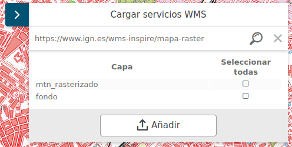

# M.plugin.AddServices

Plugin desarrollado por el [Instituto de Estadística y Cartografía](https://www.juntadeandalucia.es/institutodeestadisticaycartografia) para añadir capas WMS de forma dinámica únicamente indicado la URL del servicio.




## Dependencias
- addservices.ol.min.js
- addservices.ol.min.css

## Ejemplo 
```javascript
   const map = M.map({
     container: 'map'
   });

   // crear el plugin
   const mp = new M.plugin.AddServices();

   // añadirlo al mapa
   map.addPlugin(mp);
});
```
