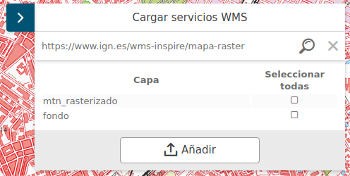

# M.plugin.AddServices

Plugin desarrollado por el [Instituto de Estadística y Cartografía](https://www.juntadeandalucia.es/institutodeestadisticaycartografia) para añadir capas WMS de forma dinámica únicamente indicado la URL del servicio. 




## Dependencias
- addservices.ol.min.js
- addservices.ol.min.css

# Parámetros
El constructor se inicializa con un JSON de _options_ con los siguientes atributos:

- **http**. Valor booleano que indica que se acepte servicios bajo el protocolo http

- **https**. Valor booleano que indica que se acepte servicios bajo el protocolo https

# Ejemplos

## Ejemplo 1
```javascript
   const map = M.map({
     container: 'map'
   });

   // crear el plugin
   const mp = new M.plugin.AddServices();

   // añadirlo al mapa
   map.addPlugin(mp);
});
```

## Ejemplo 2
```javascript
   const map = M.map({
     container: 'map'
   });

   // crear el plugin. Sólo admitiría servicios WMS bajo https
   const mp = new M.plugin.AddServices({
     http: false,
     https: true
   }
   );

   // añadirlo al mapa
   map.addPlugin(mp);
});
```
