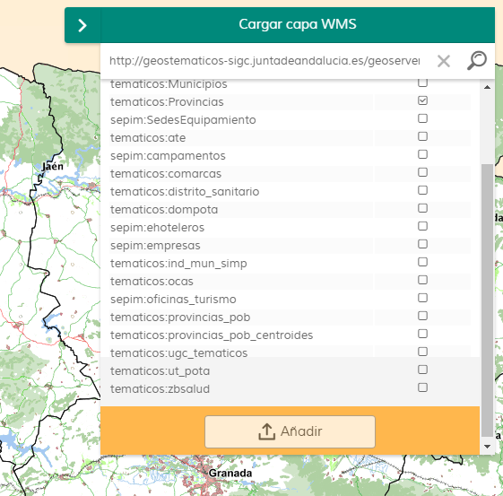

# Add Services

[](https://github.com/sigcorporativo-ja/Mapea4-dev-webpack)  

## Descripción

 Plugin de [Mapea](https://github.com/sigcorporativo-ja/Mapea4) desarrollado por el [Instituto de Estadística y Cartografía](https://www.juntadeandalucia.es/institutodeestadisticaycartografia) para añadir capas WMS de forma dinámica únicamente indicado la URL del servicio

 

 
## Recursos y uso

- js: addservices.ol.min.js
- css: addservices.min.css

```javascript
// crear el plugin
var mp = new M.plugin.AddServices();

// añadirlo al mapa
myMap.addPlugin(mp);
});
```  
